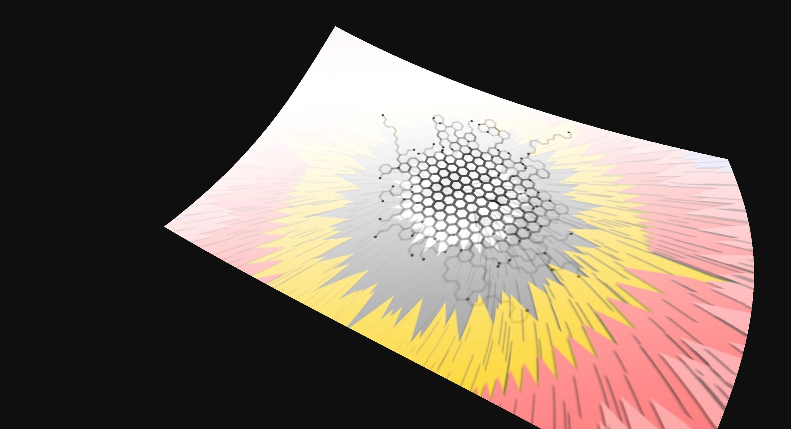

# Proto - Theejs - Shader

| | | |
|:-------------------------:|:-------------------------:|:-------------------------:|
|| ||
||||

[View prototypes](https://mauriciomassaia.github.io/proto-threejs-shader/)

## Scripts

### `npm i`

Install dependencies:

### `npm start`

Access via [http://localhost:3000](http://localhost:3000)

### `npm run build`
Build all prototypes into dist folder

To build specific prototypes into a dist folder use:

`npm run build [proto number]`

Example to build protos 01 13, 31 and 50 just use spaces:

`npm run build 13 31 50`

### `npm run index`
Generate the index.html with a list of links for each prototype.

### Deploy gh-pages

To deploy `gh-pages` I followed this [awesome article](https://medium.com/linagora-engineering/deploying-your-js-app-to-github-pages-the-easy-way-or-not-1ef8c48424b7). Thanks [Christophe Hamerling](https://github.com/chamerling)

For fresh clones or if you delete the dist folder by mistake please run :

`git worktree add ./dist gh-pages`

Updating `gh-pages` branch:
```
cd dist/
git add .
git commit -m "Update protos"
git push origin gh-pages
```

---

[](https://github.com/standard/standard)

